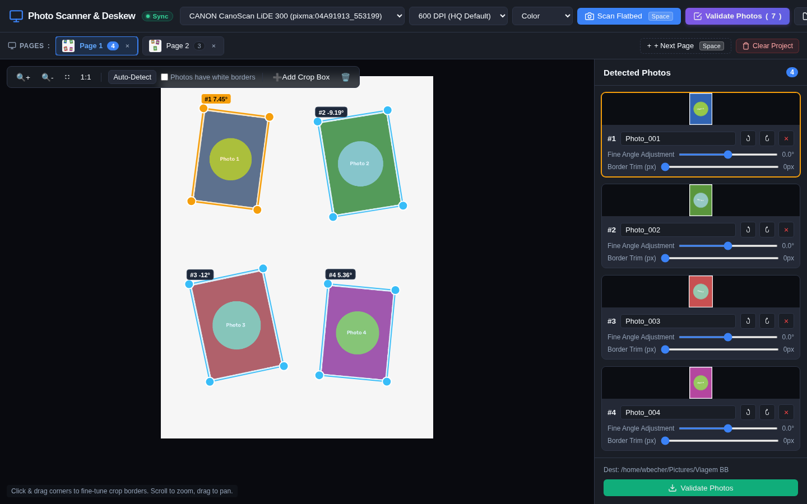
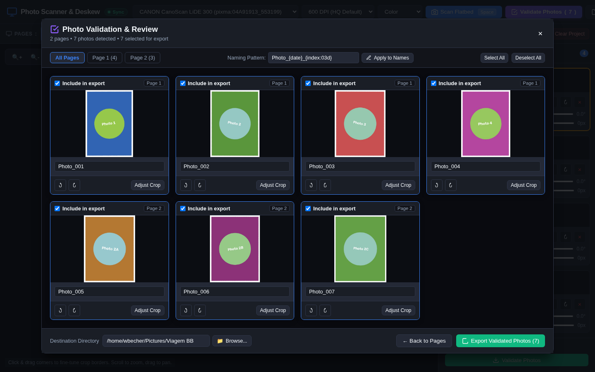
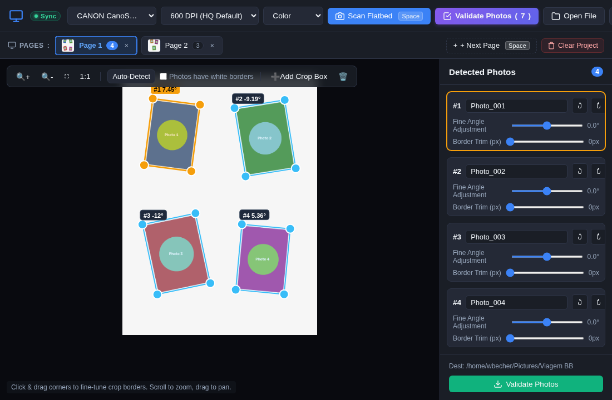
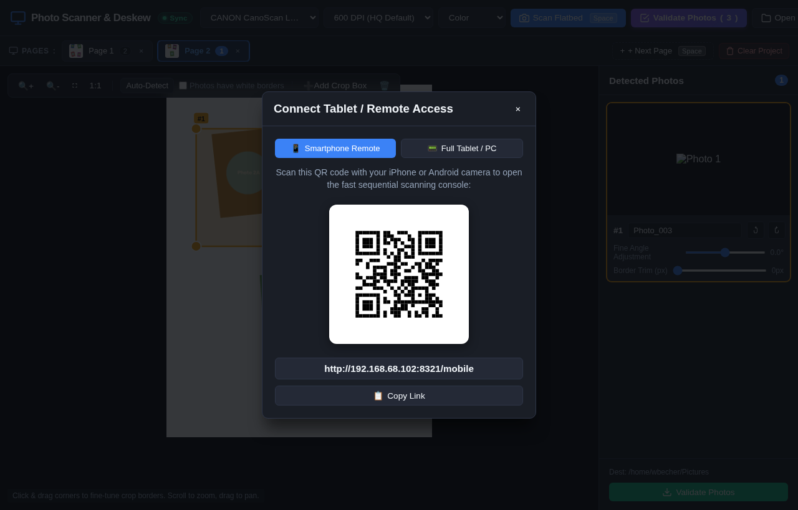
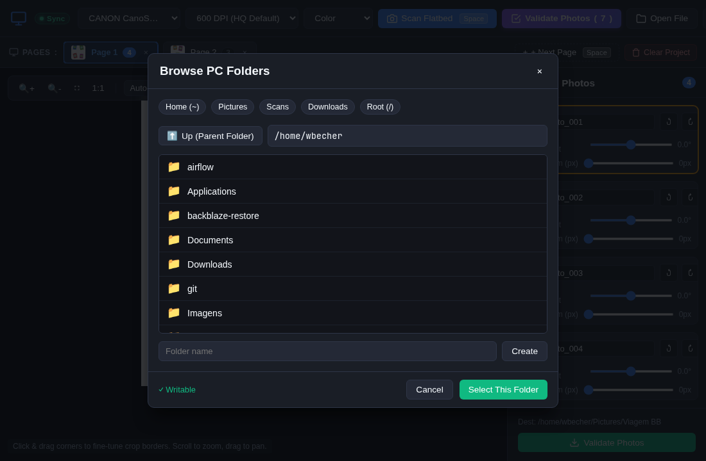

# Photo Scanner & Deskew 📸

A high-performance multi-photo scanning, auto-detection, cropping, and deskewing workstation designed for Linux desktop and remote tablet workflows.

Scan multiple photos placed at arbitrary angles on a flatbed scanner in a single pass, auto-straighten them, review and validate them in batch across multiple pages, and export high-resolution individual image files with embedded DPI metadata.



---

## ✨ Key Features

### 🎯 Automated Multi-Photo Detection & Deskewing
- **Simultaneous Detection**: Automatically identifies multiple individual prints placed in any orientation or angle on the flatbed in a single scan.
- **Sub-Pixel Perspective Transformation**: Corrects perspective distortion and tilts with sub-degree precision using OpenCV (`cv2.warpPerspective` with Lanczos-4 interpolation).
- **Interactive Multi-Point Canvas**: Drag corner handles with mouse or touch, add custom crop areas, adjust fine rotation angles, and trim photo borders in real-time.
- **Adaptive Edge Detection**: Works seamlessly with both white scanner lids and dark scanning backgrounds.

---

### 🗂️ Multi-Page Batch Sessions
- **Visual Pages Strip**: Scan dozens of flatbed pages consecutively. The visual carousel strip tracks thumbnails, page order, and photo counts per page.
- **Persistent Server Session Cache**: Your scanned pages and crop configurations are automatically cached on the server. Close the browser, restart the server, or reconnect from another device without losing your progress.
- **Hands-Free Scanning Shortcut**: Tap <kbd>Space</kbd> or <kbd>Ctrl</kbd>+<kbd>Enter</kbd> to trigger the next flatbed scan while swapping photo prints at the scanner.

---

### ✅ Unified Photo Validation & Review Gallery



- **Consolidated Multi-Page Review**: Inspect all detected photos from every scanned page in one centralized, high-contrast review grid.
- **Selective Batch Export**: Toggle checkboxes to include or exclude specific photos from the final batch export.
- **Per-Photo Quick Fixes**: Rotate individual images by 90° CW/CCW, fine-tune names, or jump directly back to the canvas coordinate with "Adjust Crop".
- **Dynamic Token Batch Naming**: Batch apply custom naming formats using pattern tokens such as `{date}`, `{index:03d}`, and `{page}` (e.g. `Family_Album_{date}_{index:03d}.jpg`).

---

### 📱 Remote Tablet Scanning & Real-Time LAN Sync

| Tablet Touch Interface | Quick Connect QR Code |
| :---: | :---: |
|  |  |

- **Place Your Tablet Next to the Scanner**: Turn an iPad, Android tablet, or phone into a portable remote control scanning console right next to your scanner.
- **Instant Wi-Fi Pairing**: Click the remote icon or scan the ASCII QR code printed in the terminal to connect instantly on your local network.
- **Real-Time WebSocket Synchronization**: Any scan, crop edit, or adjustment made on the tablet instantly updates the PC screen in real-time, and vice-versa.
- **Touch-Optimized Gestures**: Pinch-to-zoom, two-finger pan, and 24px corner handles designed specifically for finger manipulation on capacitive touchscreens.
- **Headless PC Mode**: Run the server with `--no-browser` on your PC without popping up local windows, managing the entire scanning workflow from your tablet.

---

### 📂 Integrated Server-Side Folder Browser



- **Remote Directory Navigation**: Browse and select any folder on the host PC directly from your tablet or remote browser.
- **Instant Shortcuts**: One-click access to Home (`~`), Pictures, Scans, Downloads, and Root (`/`).
- **Create New Folders**: Create new destination subdirectories on the fly with permissions checks (`✓ Writable`).
- **Native File Manager Integration**: Open destination folders on Linux with a single click (`xdg-open`).

---

### ⚙️ Archival-Grade Export & Customization
- **High-Resolution Scanning**: Supports 75 DPI up to 1200 DPI (hardware permitting) via SANE.
- **Archival Formats**: Save as JPEG (custom quality), lossless PNG, or uncompressed TIFF.
- **Embedded DPI Metadata**: Saves actual physical resolution tags (EXIF / JFIF / TIFF tags) into exported files.
- **Bilingual Support**: Built-in instant switching between **English** and **Português**.
- **Hardware-Free Demo Mode**: Built-in multi-page demo scanner simulator allows testing all detection, review, and export features without physical scanner hardware.

---

## 🛠️ Prerequisites

### Linux System Packages
Ensure SANE (Scanner Access Now Easy) and Zenity are installed:

```bash
# Arch Linux / Manjaro
sudo pacman -S sane zenity

# Debian / Ubuntu / Linux Mint
sudo apt update && sudo apt install -y sane sane-utils zenity

# Fedora
sudo dnf install sane-backends sane-backends-drivers-scanners zenity
```

Verify your scanner is detected by SANE:
```bash
scanimage -L
```

---

## 🚀 Quick Start

### 1. Clone the repository
```bash
git clone https://github.com/wbecher/scanner-photos.git
cd scanner-photos
```

### 2. Launch the Application
Run the launcher script:
```bash
./run.sh
```

`run.sh` will automatically:
1. Create a Python virtual environment using `uv` (or standard venv).
2. Install the package dependencies.
3. Start the FastAPI server on `0.0.0.0:8321`, accessible across your local Wi-Fi/LAN network.
4. Display your PC's local IP (`http://192.168.x.x:8321`) and an ASCII QR code in the terminal.
5. Open the interface locally in native app window mode via Chromium, or launch your default web browser.

---

## 📱 Remote Smartphone & Tablet Workflows

You can use your PC as the central scanning and storage workstation while controlling the flatbed scanner remotely from your smartphone or tablet next to the machine:

### 🤳 Smartphone Remote Console (`/mobile`) — Rapid Sequential Scanning
Designed specifically for one-handed operation on iPhone and Android smartphones while standing in front of the scanner:
1. **Instant QR Pairing**: Click **Tablet** in the desktop top bar and select the **Smartphone Remote** tab, or point your phone camera at the QR code.
2. **One-Touch Sequential Scanning**: Tap the prominent **Scan Next Page** button.
3. **Tactile & Audio Feedback**: Receive haptic vibration and a chime notification as soon as the scan finishes, signaling that you can immediately swap prints on the flatbed glass.
4. **Session Reel**: View thumbnails of scanned pages and discard misaligned scans directly from the phone.
5. **Desktop Handoff**: All pages are cached and synchronized to your PC hard drive in real time via WebSocket. When you finish scanning your stack of photos, return to your PC to fine-tune crops, deskew angles, and batch export!

---

### 📟 Full Tablet Interface — Touch Editing Station
For iPad and Android tablets (10"+ displays in landscape) placed near the workstation:
- Open `http://<YOUR_PC_IP>:8321` on Safari or Chrome.
- Full multi-point canvas with 24px finger touch targets, pinch-to-zoom, two-finger panning, and integrated server folder browser.

> [!TIP]
> Ensure your PC and phone/tablet are connected to the same Wi-Fi network. If you have an active firewall on Linux (`ufw`), ensure port 8321 is allowed:
> ```bash
> sudo ufw allow 8321/tcp
> ```

---

## 📦 Standalone Binary Executable (No Python Required)

You can compile Photo Scanner & Deskew into a single, standalone Linux ELF binary executable. The resulting binary bundles Python, OpenCV, FastAPI, and all web assets into a self-contained executable that runs on any modern 64-bit Linux distribution without requiring Python or virtual environments installed.

### 1. Build the Binary
```bash
./build.sh
```
This compiles the application and outputs the standalone executable to:
```text
dist/scanner-photos
```

### 2. Run the Standalone Binary
```bash
# Launch app directly (opens Chromium/browser automatically)
./dist/scanner-photos

# Or run with CLI options:
./dist/scanner-photos --port 8321
./dist/scanner-photos --no-browser
./dist/scanner-photos --help
./dist/scanner-photos --version
```

### 3. Optional: Install System-Wide
To install the binary so it can be launched from anywhere in your terminal:
```bash
sudo cp dist/scanner-photos /usr/local/bin/
```

---

## ⌨️ Keyboard Shortcuts

| Shortcut | Action |
|---|---|
| <kbd>Space</kbd> / <kbd>Ctrl</kbd>+<kbd>Enter</kbd> | Scan next flatbed page |
| <kbd>V</kbd> | Open Photo Validation & Review gallery |
| <kbd>+</kbd> / <kbd>=</kbd> | Zoom in |
| <kbd>-</kbd> | Zoom out |
| <kbd>0</kbd> | Fit flatbed to screen |
| <kbd>Delete</kbd> / <kbd>Backspace</kbd> | Delete selected photo box |
| <kbd>Esc</kbd> | Close open modal (Validation / Settings) |

---

## 📁 Project Structure

```text
scanner-photos/
├── docs/
│   └── img/                 # High-resolution application screenshots
│       ├── main_desktop.png
│       ├── validation_modal.png
│       ├── tablet_landscape.png
│       ├── tablet_qr_modal.png
│       └── folder_browser_modal.png
├── src/
│   └── scanner_photos/
│       ├── __init__.py
│       ├── main.py          # FastAPI application, REST endpoints, WebSockets & cache
│       ├── scanner.py       # SANE / scanimage hardware integration
│       └── vision.py        # OpenCV photo detection, deskewing & PIL export
├── static/
│   ├── index.html           # Single-page application UI
│   ├── css/
│   │   └── style.css        # Modern dark-mode styling & responsive layout
│   └── js/
│       ├── app.js           # Client orchestration & multi-page session state
│       ├── canvas.js        # Interactive HTML5 Canvas coordinate editor
│       └── i18n.js          # Internationalization dictionary (EN / PT)
├── tests/
│   ├── test_api.py          # FastAPI endpoints & batch export tests
│   └── test_vision.py       # Computer vision deskew and detection unit tests
├── pyproject.toml           # Project metadata & Python dependencies
├── build.sh                 # PyInstaller one-click standalone compilation script
├── scanner-photos.spec      # PyInstaller bundling specification
├── run.sh                   # App startup & desktop launcher script
├── scanner-photos.desktop   # Linux desktop application entry
└── README.md
```

---

## 🧪 Running Automated Tests

Run the test suite with `pytest`:

```bash
.venv/bin/pytest
```

---

## 📄 License

MIT License. Feel free to use, modify, and distribute.
